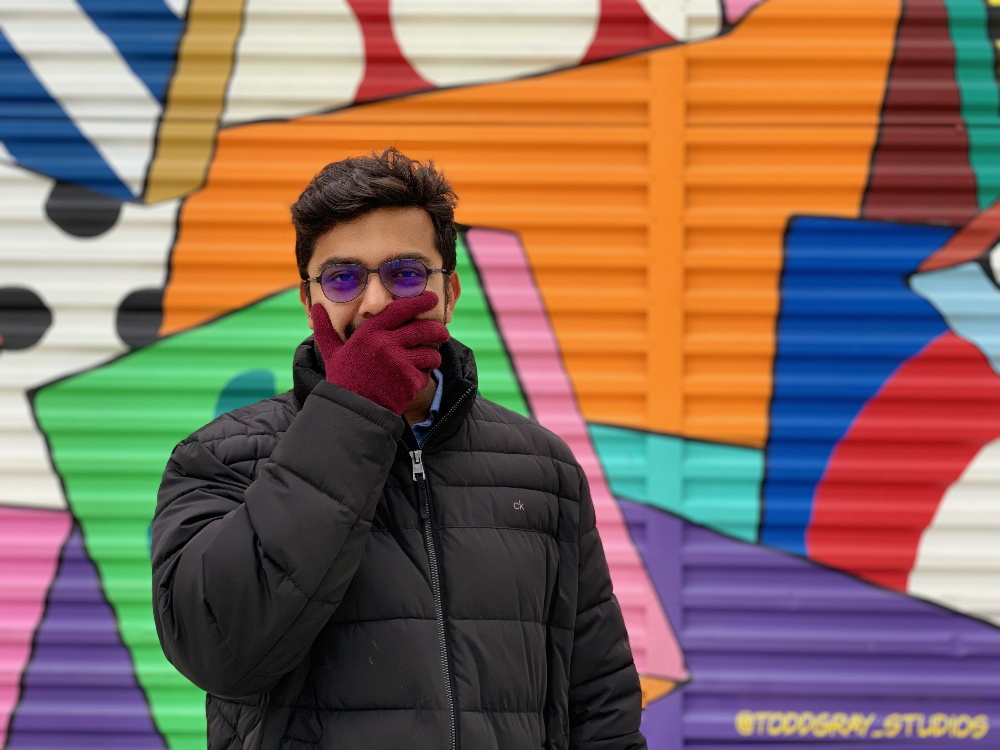

## About Me

I am an apprentice at [SEFCOM](http://sefcom.asu.edu/), [Arizona State University](https://www.asu.edu/). My research interests focus on software security, including automated binary analysis and Web Security. I completed my Undergrad from [Amrita University](https://www.amrita.edu/), India.

I play CTF's with [Shellphish](http://shellphish.com/) and [Team bi0s](https://bi0s.in/). You can find the write-ups that I occasionally write [here](blog.com)

## Research Experience

1. Research Assistant at [SEFCOM](http://sefcom.asu.edu/), Arizona State University.

## Academic Experience

1. Teaching Assistant for [CSE-591](https://www.tiffanybao.com/courses/cse591/) course at Arizona State University.

## Education

1. B. Tech in Computer Science, [Amrita University](https://www.amrita.edu/)
