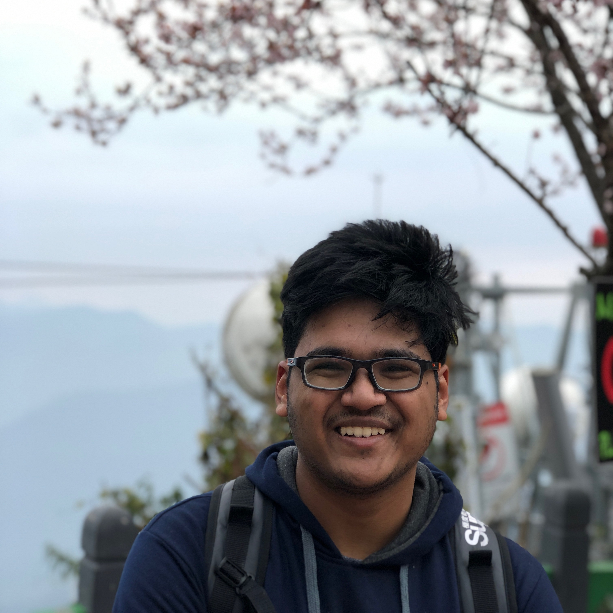

> "An unexamined life is not worth living" - Plato

## About Me

Hi! I am Archit, a sophomore at Indian Institute of Technology, Kharagpur currently completing a BS+MS in Mathematics and Computing. I've had stints with competetive programming and software development.  Currently, I'm a software team member at Aerial Robotics Lab, Kharagpur and an independent researcher into NLP, Reinforcement Learning and Image Processing.

Hit me up if you've got a cool idea regarding any of those and wish to collaborate!

## Present

* Preparing for IMAV 2019, a micro aerial vehicle competition. At ARL, I'm currently trying to autonomously detect helipads, navigate through a shelf and others to complete the IMAV challenge.

* Trying to measure the convergence of a chaotic sequence. The intended goal is to find suitable learning rates for gradient descent automatically and create a new class of optimizers. Based on Kullback–Leibler divergence and Logistic Distribution. 

* You can find me on codeforces as [architrungta120](https://codeforces.com/profile/architrungta120). I've recently started dipping my toes in competetive programming again.

## Past

* Made a glove with Shreyansh Darshan that uses IMU sensor to map the entire hand with all its motions. As a sample use, created neural networks to learn sign language symbols and interpret. The project was coded in C++ and Python.  [Video demonstration](https://youtu.be/Rl1C584UrW0).

* Had a stint with PoW cryptocurrency miners. Wrote the first [GPU miner for Keccak PoW](https://bitcointalk.org/index.php?topic=453573.0). Collaborated with [Dr. Dave Anderson](https://www.cs.cmu.edu/~dga/) from CMU to port his Linux CUDA miner for Momentum to Windows. Also wrote one of the first two Monero mining pools. 

* Wrote a 3D perspetive projector from scratch using C++ and Windows API as highschool senior year CS project. 

* Developed some of the most popular mods for Call of Duty : Modern Warfare 3 back in 8th grade. Including [External RCON](https://www.itsmods.com/forum/Thread-Release-BigBrotherBot-External-Rcon-0-5-Chat-viewer-0-2-beta.html) and [MapEdit](https://www.itsmods.com/forum/Thread-Release-MapEdit-for-MW3-1-4.html).

* Attended the Indian Informatics Olympiad Training Camp in 2017 and 2018. First participant from my state ever and the youngest one at 'TC 2017. 

## Future

* ICPC? 

* Graduate?

* More research?

* ...

## Random

* Whiteboards help me think better. The bigger, the better. 

* I love going out for trips and exploring different cultures/environments!

* Indian Food > All other cuisines. Please change my mind. 

* airbnb > hotels. Can't change my mind.

* Anime > everything else. 

* Coldplay is <3 

## Publications

Hopefully coming soon!

