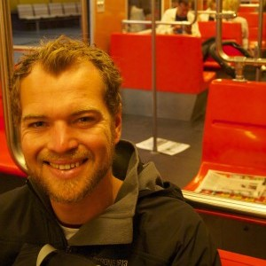

## About Me

Hi! I am the eResearch Analyst employed by Intersect Australia, based at the University of New England, Armidale, NSW. I have been in this role for two years and based at UNE for nine years. I moved to Armidale from Melbourne to undertake a PhD in 2010 in the inter-disciplinary field of peace and conflict studies. My PhD was focused on the [socio-cultural impacts of the democratisation of Timor-Leste](https://osf.io/fmsnh/). 

[Read more here...](/resume/about)

## Experience
### eResearch Analyst, Intersect Australia
*May 2016-ongoing*

For Intersect Australia I am currently based at UNE, reporting to the Deputy Vice Chancellor - Research, Prof. Heiko Daniel. Whilst based in the Research Services Directorate, the role demands working collaboratively with the University Library and the IT Directorate, as well as the faculties. 

Through these various relationships I have been an active member of a number of UNE's grant-funded research projects, strategic university-wide eResearch initiatives, and researcher training events. I have included a selection below:

#### Strategic initiatives
* Chairing the university's [eResearch Committee](http://www.une.edu.au/research/digital-research-support/eresearch-committee), a committee sponsored by the DVCR, since August 2016, established to advance the universities eResearch services. Since my time as chair, I have overseen the Committee's restructure and renewal; continuously reported to the University Research Committee and the DVCR; and led the investigation of various university eResearch capabilities.
* Initiating and leading a year-long, university-wide Research Data Management project to build awareness amongst researchers, streamline corporate workflows, advocate for further investment into infrastructure capabilities, and establish and maintain weekly reports on UNE researchers' usage of the institutional cloud storage platform, [Cloud.UNE](cloud.une.edu.au).
* Earlier this year, I also undertook a [web-scraping and text analysis project](https://github.com/paddytobias/eResearchImpactEngagement) to support UNE's preparation for the Research Engagement and Impact assessment, using 2014 submissions to the UK REF Impact assessment.  

#### Research projects
* Currently working with Dr Jason Stoessel on an ARC Discovery project in digital musicology and supporting the successful application for a successive ARC Discovery grant awarded to Dr Stoessel and his colleague, Dr Denis Collins (UQ). My work in this project has involved leading the EFT of ~5,000 data records from a FileMaker Pro database into an open source online database repository called Muscat using database techniques; scripting bug fixes in Python and SQL; and supporting a constructive relationship between Dr Stoessel and Intersect's Engineering team. A staging version of the [Canonic Techniques website](https://canons-staging.intersect.org.au/catalog) is live. 
* In 2016-17, I initiated and lead the [Ngan'gi Language Collection Enhancement](https://projects.ands.org.au/id/CEP13) project for A/Prof. Nick Reid, funded by the Australian National Data Service. This including scoping realistic web-based solutions for A/Prof Reid's requirements, managing the execution of the project from start to finish, and coordinating user acceptance testing, content migration and training. A/Prof and I [presented the project](https://conference.eresearch.edu.au/2017/08/improving-the-online-profile-of-the-ngangi-language-collection/) at the 2017 eResearch Australasia conference.

#### Education & Training
* I currently coordinate Intersect's training program at UNE, delivering many of the courses myself with the help of two on-campus trainers. Over the past two years I have worked to improve researcher guidance on course scheduling and systematised the notification of courses once they have been booked. I am currently developing new courseware for [teaching the survey tool, Qualtrics](https://github.com/IntersectAustralia/surveys-with-qualtrics), and [research software management](https://github.com/paddytobias/research-software-management). 
* I regularly presenting to researchers and staff on eResearch capabilities, including data and software management techniques, and help researchers in their scripting tasks. 
* I currently sit on the organising committee for [Sydney ResBaz (3-5 July)](https://resbaz.github.io/resbaz2018/sydney/), primarily to oversee an increase in the representation from regional NSW universities at this year's event. I will also be lead instructor of the [*Introductory R* stream](https://paddytobias.github.io/2018-07-03-resbaz-syd-intro-r/) at this year's event. 

## Other experience
* Corporate Communications Officer (2015-2016), *UNE*
* Research Fellow (2014), *Queen's University* (Belfast)
* Lead consultant (2013), Women’s Empowerment and Access to Justice project in Timor-Leste for *Search for Common Ground* (Washington)

## Education
**PhD**, *Cum laude*. University of New England, 2010-2015

**M.DataScience**. University of New England, 2018-ongoing

**B.IntRelations**, *Distinction*. Deakin University, 2007-2009



## Side projects
* 2016, [Cleaning 2015 Census data for Timor-Leste](https://github.com/paddytobias/15census_timor_dataclean/settings)
* 2018, [Identifying patterns in language in Peace and Conflict Studies literature](https://paddytobias.github.io/language-in-peacebuilding/)

## Selected Publications

1. Tobias, P. & N Reid, 2017, 'Improving the online profile of the Ngan’gi Language Collection', [eResearch Australasia](https://conference.eresearch.edu.au/2017/08/improving-the-online-profile-of-the-ngangi-language-collection/)
2. Reeson, R & P Tobias, 2017, 'Working towards the “end-to-end”: Research Data Management Capability Development at UNE', [eResearch Australasia](https://conference.eresearch.edu.au/2017/09/working-towards-the-end-to-end-research-data-management-capability-development-at-une/)

#### Other academic publications
1. Tobias, P. 2017, ‘Truth and Reconciliation in Timor-Leste: Some reflections ten years on’, in Reconciliation in conflict affected communities: Experiences and insights from the Asia-Pacific, Springer.
2.  Tobias, P & B Kovac (eds.), 2016, ‘Questioning “peace formation” and “peace infrastructure”’, a special edition of papers with [The Peace and Conflict Review journal](http://www.review.upeace.org/images/PCR9.1.pdf)
3. Tobias, P. 2014, ‘Modernisation in Timor Leste: The “Community” at Stake’, in The Love of Education: Learning to Live Together, Bangkok: UNESCO, Asia-Pacific Programme of Educational Innovation for Development.
4. Tobias, P 2014, ‘Keeping Community: Traditional Culture and Implications for Maintaining Peace in Post-Conflict Society in Aileu, Timor Leste,’ in H Ware, B Jenkins, M Branagan & D Subedi (eds), Cultivating Peace: Contexts, Practices and Multidimensional Models, Cambridge Scholar Publishing, Newcastle upon Tyne.
5. Tobias, P, 2012, ‘Maintaining a Civic Nation: social cohesion in Timor Leste’, M Leach, NC Mendes, AB. da Silva, B Boughton & A da Costa Ximenes (eds.), New Research in Timor Leste, Melbourne: Swinburne Press. 
