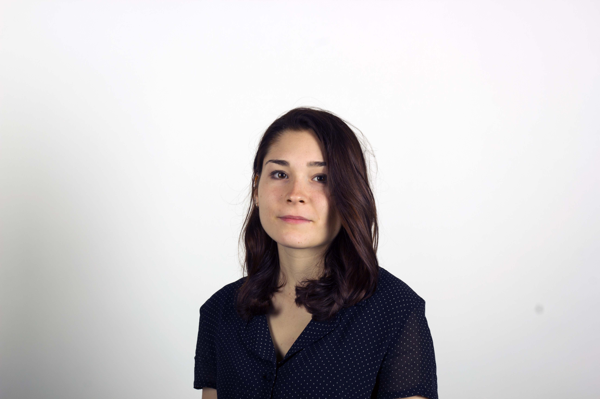

## About

I am a Ph.D Students in Italian National Doctoral Program in Artificial Intelligence at the University of Pisa and University of Bari "Aldo Moro".
In 2020, I completed a Master Degree in Communication Design at the Polytechnic University of Milan, developing my thesis at the DensityDesign research lab. After that, I obtained a one-year Master Degree in Big Data Analytics and Social Mining at the University of Pisa.
I am a Memeber of the [XAI research Group](https://xai-project.eu/) and [IVU lab](http://ivu.di.uniba.it/)

## Research Interest

My research Interests focus on Human Centered AI, Explainable AI and Visual Analytics. 
I am currently working on developing Explainable User Interfaces.

## Publications

1. De Keulenaar E., Kisjes I., Smith R., Albercht C., Wilson J., Cappuccio E. *Authority and misinformation in the process of COVID-19 sensemaking"*, 2022, - part of Mainstreaming the Fringe, Rogers R. - Amsterdam University Press - **under revision**
2. Cappuccio E., Mauri. M. *Visualization practices on Wikipedia and Wikimedia Commons*, 2022 - **under revision**

## Selected Projects

Selection of some projects developed throughout the years:

- [Comizi d'Amore 2.0](https://masterbigdata.it/sites/default/files/projects/2020-2021/comizi_amore/), Final project of the Master in Big Data Analytics and Social Mining at Univeristy of Pisa, 2021
- [Predicting Travel Trends from Italy to Cuba](https://datashack2019.github.io/alpitour-datashack2019/)project developed with 2 students from the Institute for Applied Computational Science (IACS), Harvard University, and 1 student from the Computer Engineering Masters Degree at Politecnico di Milano, 2019
- [Infopoetry](https://infopoetry.densitydesign.org/) - An archive for some of the projects developed by the Students during the Final Synthesis Studio held by DensityDesign Lab at Politecnico di Milano, 2019

## Education and Experiences

Year | Institution | Cathegory | Description
-----|-------|--------|-------
2017 | Politecnico di Milano | Bachelor Degree | Bachelor Degree in Communication Design
2018 | Centennial College | Exchange | Exchange Student in Toronto, Interactive Media Management Master
2019 | Politecnico di Milano/ Harvard University| Project  | Participated to a [joint data science project](http://datashack.deib.polimi.it/) between 4 students from the Institute for Applied Computational Science (IACS) of Harvard and 4 students from the Communication Design and Computer Engineering Masters Degree at Politecnico di Milano.
2019 | Politecnico di Milano | Internship | Intern at [Density Design Research Lab](https://densitydesign.org/)
2019 | University of Amsterdam | Summer School | Tutor during the summer school organized by the [Digital Methods Initiative](https://wiki.digitalmethods.net/Dmi/SummerSchool2019)
2020 | UNA studio | Work | Data visualization designer for the [Antarctic resolution project](https://www.lars-mueller-publishers.com/antarctic-resolution)
2020 | University of Amsterdam | Summer School | Tutor during the summer school organized by the [Digital Methods Initiative](https://wiki.digitalmethods.net/Dmi/SummerSchool2020) 
2020 | Politecnico di Milano | Master Degree | Master Thesis on User generated data visualizations on Wikipedia and Commons
2021 | Università di Pisa | Master Program | Master in Big Data Analytics and Social Mining
2021-Ongoing | Università di Pisa | Ph.D | Ph.D students in Artificial Intellingence

---

## Conference and Talk

- [IUI Conference 2022](https://iui.acm.org/2022/),**As Audience**
- [ItWikiCon2020](https://2020.itwikicon.org/), Talk: "La data visualization sui progetti Wikimedia", Speaker
