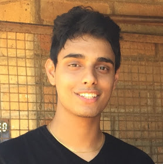

## About Me

I am a PhD researcher at the Australian Centre for Robotic Vision working on control and machine learning for robotics. My research focuses on deep reinforcement learning and how we can effectively exploit prior and structural knowledge within the framework to guide and accelerate training, and to allow for safe real-world deployment of learnt policies. 

## Publications

1. <b>Rana, K.</b>, Talbot, B., Milford, M., & Sünderhauf, N. (2020). "Residual Reactive Navigation: Combining Classical and Learned Navigation Strategies For Deployment in Unknown Environments". 2020 IEEE International Conference on Robotics and Automation (ICRA), 11493-11499.  
[[Paper]](https://arxiv.org/pdf/1909.10972.pdf) [[Code]](https://github.com/krishanrana/2D_SRRN) [[Site]](https://sites.google.com/view/srrn/home)

2. <b>Rana, K.</b>, Dasagi, V., Talbot, B., Milford, M., & Sunderhauf, N. (2020). "Multiplicative Controller Fusion: Leveraging Algorithmic Priors for Sample-efficient Reinforcement Learning and Safe Sim-To-Real Transfer". 2020 International Conference on Intelligent Robots and Systems (IROS)  
[[Paper]](https://arxiv.org/abs/2003.05117) [[Code]](https://github.com/krishanrana/multiplicative_controller_fusion) [[Site]](https://sites.google.com/view/mcf-nav/home)

3. Palmer, D.W., Coppin, T., <b>Rana, K.</b>, Dansereau, D., Suheimat, M., Maynard, M., Atchison, D., Roberts, J., Crawford, R., & Jaiprakash, A. (2018). "Glare-free retinal imaging using a portable light field fundus camera". Biomedical Optics Express, 9, 3178 - 3192.  
[[Paper]](https://www.osapublishing.org/viewmedia.cfm?seq=0&uri=boe-9-7-3178)

4. Melnik, A., Harter, A., Limberg, C., <b>Rana, K.</b>, Sünderhauf, N., & Ritter, H. "Critic Guided Segmentation of Rewarding Objects in First Person Views". German Conference of Artificial Intelligence, 2021.  
[[Paper]](#)

5. <b>Rana, K.</b>, Dasagi, V., Haviland, J., Milford, M., & Sünderhauf, N. "Bayesian Controller Fusion" [In preparation for IJRR]  
[[Paper]](#) [[Code]](#) [[Site]](https://krishanrana.github.io/bcf)

## Patents

1. Ophthalmic Imaging Apparatus and System  
   Patent Number au2017901153  
   A. Jaiprakash, D. Palmer, D. G. Dansereau, T. Coppin, K. Rana, J. Roberts, R. Crawford  
   
2. Method and System for Calibrating an Ophthalmic Imager   
   Patent Number au2018900513   
   D. Palmer, T. Coppin, K. Rana
   
## Grants

UA-DAAD Australia-Germany Joint Research Cooperation Scheme
Project: Sample-efficient learning for autonomous agents in complex hierarchical, and sparse environments

