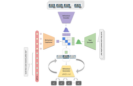
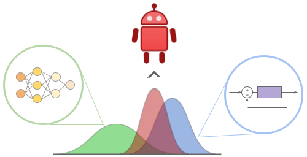
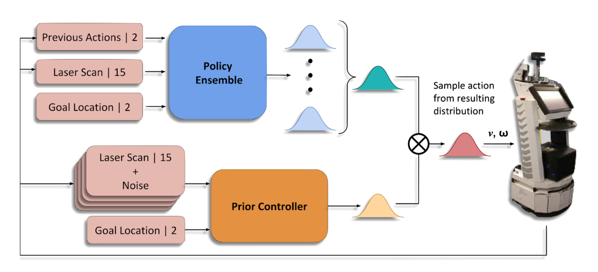
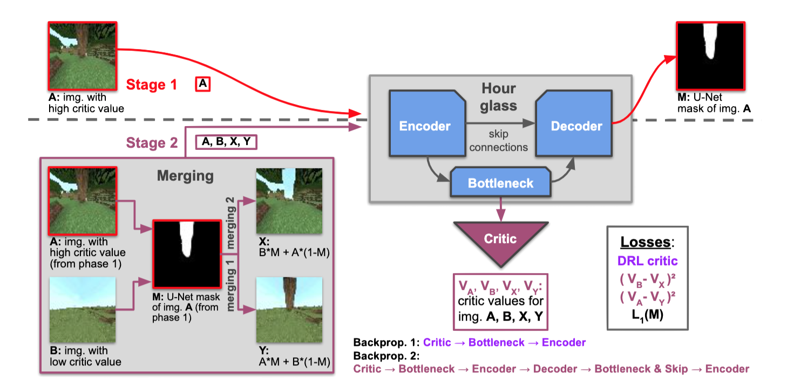

## About Me

I am postdoctoral researcher at the QUT Centre for Robotics working on control and machine learning for robotics. My research focuses on how to effectively exploit prior and structural knowledge in deep reinforcement learning in order to guide and accelerate training. I am also interested in the safe deployment of RL policies on real robots. Feel free to contact me on <ranak@qut.edu.au>.

## Publications

1.  <b>Rana, K.</b>, Haviland, J., Garg, S., Abou-Chakra, J., Reid, I., & Sünderhauf, N. <em>"SayPlan: Grounding Large Language Models using 3D Scene Graphs for Scalable Task Planning"</em> 2023 [under review] 
[[Site]](https://sayplan.github.io)

2.  <b>Rana, K.</b>, Haviland, J., Garg, S., Abou-Chakra, J., Reid, I., & Sünderhauf, N. <em>"Leveraging 3D Scene Graphs in Large Language Models for Task Planning"</em> RSS 2023 Workshop on Robot Representations For Scene Understanding, Reasoning and Planning  
[[Paper]](https://openreview.net/pdf?id=sxKR6zhBDH](https://mit-spark.github.io/robotRepresentations-RSS2023/assets/papers/10.pdf))

3.  <b>Rana, K.</b>, Melnik, A., & Sünderhauf, N. <em>"Contrastive Language, Action, and State
Pre-training for Robot Learning"</em> 2023 ICRA 2023 Pretraining for Robotics Workshop 
[[Paper]]((https://openreview.net/pdf?id=sxKR6zhBDH))

4.  <b>Rana, K.</b>, Milford, M., & Sünderhauf, N. <em>"Residual Skill Policies: Learning an Adaptable Skill Space for Reinforcement Learning for Robotics"</em> 2022 Conference on Robot Learning (CoRL) 
[[Paper]](https://openreview.net/forum?id=0nb97NQypbK) [[Code]](https://github.com/krishanrana/reskill) [[Site]](https://krishanrana.github.io/reskill)

5.  <b>Rana, K.</b>, Dasagi, V., Haviland, J., Milford, M., & Sünderhauf, N. <em>"Zero-Shot Uncertainty-Aware Deployment of Simulation Trained Policies on Real-World Robots"</em> NeurIPS 2021 Workshop on Deployable Decision Making in Embodied Systems (DDM) | Spotlight  
[[Paper]](https://arxiv.org/abs/2112.05299) [[Code]](https://github.com/krishanrana/bcf) [[Site]](https://krishanrana.github.io/bcf)

6.  <b>Rana, K.</b>, Dasagi, V., Haviland, J., Milford, M., & Sünderhauf, N. <em>"Bayesian Controller Fusion: Leveraging Control Priors in Deep Reinforcement Learning for Robotics"</em> The International Journal of Robotics Research (IJRR)  
[[Paper]](https://journals.sagepub.com/doi/full/10.1177/02783649231167210) [[Code]](https://github.com/krishanrana/bcf) [[Site]](https://krishanrana.github.io/bcf)

7.  <b>Rana, K.</b>, Dasagi, V., Talbot, B., Milford, M., & Sunderhauf, N. (2020). <em>"Multiplicative Controller Fusion: Leveraging Algorithmic Priors for Sample-efficient Reinforcement Learning and Safe Sim-To-Real Transfer"</em>. 2020 International Conference on Intelligent Robots and Systems (IROS)  
[[Paper]](https://arxiv.org/abs/2003.05117) [[Code]](https://github.com/krishanrana/multiplicative_controller_fusion) [[Site]](https://sites.google.com/view/mcf-nav/home)

8.  <b>Rana, K.</b>, Talbot, B., Milford, M., & Sünderhauf, N. (2020). <em>"Residual Reactive Navigation: Combining Classical and Learned Navigation Strategies For Deployment in Unknown Environments"</em>. 2020 IEEE International Conference on Robotics and Automation (ICRA), 11493-11499.  
[[Paper]](https://arxiv.org/pdf/1909.10972.pdf) [[Code]](https://github.com/krishanrana/2D_SRRN) [[Site]](https://sites.google.com/view/srrn/home)

9.  Melnik, A., Harter, A., Limberg, C., <b>Rana, K.</b>, Sünderhauf, N., & Ritter, H. <em>"Critic Guided Segmentation of Rewarding Objects in First Person Views"</em>. German Conference of Artificial Intelligence, 2021.  
[[Paper]](https://arxiv.org/abs/2107.09540)

10.  Palmer, D.W., Coppin, T., <b>Rana, K.</b>, Dansereau, D., Suheimat, M., Maynard, M., Atchison, D., Roberts, J., Crawford, R., & Jaiprakash, A. (2018). <em>"Glare-free retinal imaging using a portable light field fundus camera"</em>. Biomedical Optics Express, 9, 3178 - 3192.  
[[Paper]](https://www.osapublishing.org/viewmedia.cfm?seq=0&uri=boe-9-7-3178)

11.  Coppin, T., Palmer, D.W.,  <b>Rana, K.</b>, Dansereau, D., Collins, M., Atchison, D., Roberts, J., Crawford, R., & Jaiprakash, A. (2021). <em>"Design of a Focused Light Field Fundus Camera for Retinal Imaging"</em>. [Under review for IEEE Transactions on Medical Imaging (T-MI)]  

## Patents

1. Ophthalmic Imaging Apparatus and System  
   Patent Number au2017901153  
   A. Jaiprakash, D. Palmer, D. G. Dansereau, T. Coppin, K. Rana, J. Roberts, R. Crawford  
   
2. Method and System for Calibrating an Ophthalmic Imager   
   Patent Number au2018900513   
   D. Palmer, T. Coppin, K. Rana
   
## Grants

UA-DAAD Australia-Germany Joint Research Cooperation Scheme
Project: Sample-efficient learning for autonomous agents in complex hierarchical, and sparse environments

